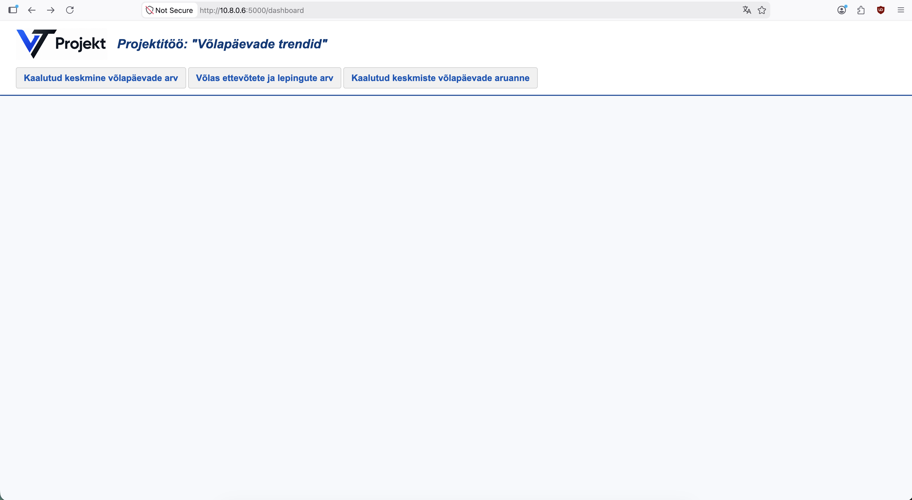
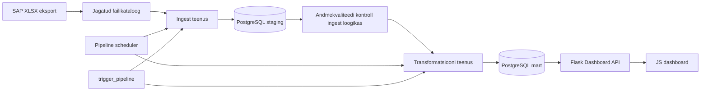

# Andmeinseneeria projekt — võlgnevuste analüüsi andmetoru

## Docker Quickstart
1. `cp .env.example .env`
    * tulemus: sul on repo root kaustas .env fail
2. `unzip docs/aruanne.zip`
    * tulemus: kataloog 'aruanne' koos raportitega on repo root kaustas
3. `docker compose up`
    * tulemus: loodud ja valmis pandud andmebaas, andmetoru jookseb automaatselt peale andmebaasi valmisolekut
4. `docker compose run --rm trigger_pipeline`: andmetoru jookseb uuesti ühe korra
5. `docker compose exec -it postgres psql -U debtuser -d debtdb`: andmebaasis toimetamiseks
6. `docker compose exec -it postgres psql -U debtuser -d debtdb -c 'select * from mart.fact_debt_snapshot'`: laenulepingu faktitabel
7. `docker compose exec -it postgres psql -U debtuser -d debtdb -c 'select * from mart.kpi_daily_debt'`: laenuportfelli ülevaade kuu lõikes
8. `docker compose down -v --remove-orphans`: eemalda volüümid ja andmetoru käsitsi käivitamisel loodud konteinerid

## Dashboard

Pärast andmetoru jooksmist mine [http://localhost:5000/dashboard](http://localhost:5000/dashboard)
Peaks avanema selline vaatepilt:


## Äriküsimus

Projekt lahendab probleemi, kus ettevõttel puudub automaatne ja ajas võrreldav ülevaade laenuklientide võlgnevustest. SAP-ist saabub regulaarselt XLSX-fail võlaandmetega ning lahendus laadib selle PostgreSQL-i, kontrollib andmekvaliteeti, arvutab KPI-d ja kuvab tulemused dashboardil. Algandmed on anonümiseeritud.

Peamine äriküsimus:

> Kuidas muutuvad võlas olevate lepingute võlapäevad ajas ning millal viitavad trendid maksekäitumise halvenemisele (portfelli tasandil ja laenuklientide tasandil)?

## Mõõdikud

1. Kaalutud keskmine võlapäevade arv: `SUM(võlapäevad * võlasumma) / SUM(võlasumma)`
2. Võlas olevate lepingute arv: `COUNT(leping_id) WHERE võlapäevad > 0`
3. Ettevõtete arv võlas: `COUNT(DISTINCT registrikood) WHERE võlasumma > 0`
4. Kaalutud keskmine võlapäevade arv ettevõtete kaupa (aruanne)

## Arhitektuur



Üldine arhitektuurikirjeldus: [`docs/arhitektuur.md`](docs/arhitektuur.md)

Detailne arhitektuuridokumentatsioon:

- Äriarhitektuur: [`docs/ari_arhitektuur/`](docs/ari_arhitektuur/)
- IT-arhitektuur: [`docs/it_arhitektuur/`](docs/it_arhitektuur/)

## Andmestik

| Allikas | Tüüp | Ajas muutuv? | Roll |
|---|---|---|---|
| SAP võlaandmete eksport | XLSX | Jah, iga päev või kokkulepitud sagedusega | Sisaldab laenuklientide võlasummasid ja võlapäevade infot. |

Sisendfaili peamised veerud:

| Väli | Kirjeldus |
|---|---|
| `REG kood` | Ettevõtte registrikood. |
| `Lepingu nr` | Lepingu number. |
| `Summa` | Võlasumma. |
| `Võlapäevad` | Võlapäevade arv, kui see tuleb allikast. |

## Stack

| Komponent | Tööriist |
|---|---|
| Andmebaas | PostgreSQL |
| Sissevõtt | Python, pandas, psycopg2 |
| Andmekvaliteet | Python kontrollid ja `quality.quality_results` tabel |
| Transformatsioon | Python ja SQL |
| Orkestreerimine | Python scheduler Docker Compose teenuses |
| Dashboard API | Python Flask |
| Dashboard | HTML, CSS, Vanilla JavaScript, Apache ECharts |
| Käitus | Docker Compose teenused `postgres`, `pipeline`, `trigger_pipeline`, `api` |

## Andmevoog lühidalt

1. SAP salvestab uue XLSX-faili jagatud kataloogi.
2. Scheduler või `trigger_pipeline` kontrollib uut faili ja käivitab ingest loogika.
3. Ingest kontrollib faili kontrollsummat ning laadib read `staging` kihti.
4. Ingest kontrollib kohustuslikke välju, registrikoodi, lepingu numbrit, võlasummat ja võlapäevi ning salvestab tulemused `quality` skeemi.
5. Transform teenus täidab `mart` skeemi dimensioonid, faktitabeli, KPI tabelid ja raportivaated.
6. Flask Dashboard API loeb mart kihist KPI-d.
7. JS dashboard kuvab trendid, võlas olevate ettevõtete/lepingute arvu ja raportivaate.

## Andmekvaliteedi kontrollid

Projekt kontrollib vähemalt järgmist:

1. Registrikood on täidetud ja vastab kokkulepitud formaadile.
2. Lepingu number on täidetud.
3. Võlasumma on arvuline ega ole mart kihis negatiivne.
4. Võlapäevad on mitte-negatiivne täisarv, kui väli on failis olemas.
5. Võlapäevad jäävad lubatud vahemikku `0..3650`, kui väli on failis olemas.
6. Sama failikontrollsummaga faili ei laadita duplikaadina.
7. Vigased read salvestatakse `quality.quality_results` tabelisse koos vea põhjusega.
8. Mart kihis kontrollitakse, et snapshoti summa on positiivne, lepingute arv ei ole 0 ja staging kuupäev on martis olemas.

## Käivitamine

Rakenduskood ja `compose.yml` on olemas. Keskkonna käivitamiseks:

```bash
docker compose up --build
```

Dashboardi aadress:

```text
http://localhost:5000/dashboard
```

## Saladused ja konfiguratsioon

Kõik saladused, paroolid ja keskkonnapõhised väärtused peavad olema `.env` failis. Reposse tohib lisada ainult `.env.example`.

Vajalikud muutujad:

| Muutuja | Tähendus |
|---|---|
| `POSTGRES_HOST` | PostgreSQL host. |
| `POSTGRES_PORT` | PostgreSQL port. |
| `POSTGRES_DB` | Andmebaasi nimi. |
| `POSTGRES_USER` | Andmebaasi kasutaja. |
| `POSTGRES_PASSWORD` | Andmebaasi parool. |
| `ARUANNE_DIR` | SAP XLSX failide kataloog konteineris; vaikimisi `/data/aruanne`. |
| `TARGET_FILENAME` | Otsitava SAP XLSX faili nimi. |

## Projekti struktuur

```text
.
├── README.md
├── .gitignore
├── docs/
│   ├── arhitektuur.md
│   ├── docker.md
│   ├── test_raport.md
│   ├── video.md
│   ├── progress.md
│   ├── aruanne.zip
│   ├── ari_arhitektuur/
│   │   ├── 01_arikirjeldus.md
│   │   ├── 02_arireeglistik.md
│   │   ├── 03_arinfo_mudel.md
│   │   ├── 04_ontoloogia_mudel.md
│   │   ├── 05_relatsiooniline_postgresql_andmemudel.md
│   │   ├── 06_analuutiline_andmemudel.md
│   │   ├── 07_dimensionaalne_andmemudel.md
│   │   └── 08_dokumendi_mudel.md
│   └── it_arhitektuur/
│       ├── 01_kasutusmallid.md
│       ├── 02_komponent_diagram.md
│       ├── 03_evitus_diagram.md
│       ├── 04_jargnevus_diagram.md
│       └── 05_kommunikatsiooni_diagram.md
├── images/
├── services/
│   ├── api.py
│   ├── ingest.py
│   ├── transform.py
│   ├── scheduler.py
│   ├── run_pipeline.py
│   ├── templates/
│   └── static/
├── sql/
│   └── init_schema.sql
├── compose.yml
└── .env.example
```

`TMP/`, `temp/` ja `temp2/` on töö- ja võrdlusmaterjalide kaustad.

## Kokkuvõte, puudused ja võimalikud edasiarendused

**Kokkuvõte:**

- Koostatud on äri- ja IT-arhitektuuri Markdown dokumentatsioon.
- Kirjeldatud on SAP XLSX failist lähtuv automaatne andmetoru.
- Loodud on Docker Compose põhine PostgreSQL, pipeline ja Flask dashboardi teostus.
- Paika on pandud PostgreSQL skeemid, KPI-d, kvaliteedikontrollid, mart vaated ja dashboard.

**Puudused:**

- SAP faili täpne formaat ja võlapäevade arvutuse allikas vajavad jätkuvalt kinnitamist.
- `logs.pipeline_runs` tabel on arhitektuuris olemas, kuid praegune operatiivne logimine toimub peamiselt logifailides.

**Mis edasi:**

- Täiendada pipeline staatuse kirjutamist `logs.pipeline_runs` tabelisse.
- Lisada automaatsed andmekvaliteedi ja API testid.
- Täpsustada dashboardi filtreid ja raporti eksporti.
- Planeerida tulevane ML riskiskoori komponent.

## Meeskond

| Initsiaal | Nimi | Vastutus |
|---|---|---|
| JS | Jaan | Andmed, äriprobleem, dashboard ja KPI-de äriline selgitus |
| JH | Joosep | Git, Docker/Compose, pipeline/API käivitus ja tehniline demo |
| ST | Sorell | Testid, andmekvaliteedi kontrollid ja testiraport |
| AK | Anti | Arhitektuur, dokumentatsioon ja demo video salvestamine |


### Andmekvaliteedi kontroll juhend

**Staging kontrollid**

Käivituvad automaatselt ingest.py-s iga rea kohta. Tulemused salvestatakse quality.quality_results tabelisse.

| Reegel | Mida kontrollib |
|------|-----------|
| REGISTRY_CODE | Registrikood on täpselt 8-kohaline number |
| REGISTRY_CODE_NUMERIC | Registrikood sisaldab ainult numbreid |
| CONTRACT_NUMBER | Lepingu number on täidetud |
| DEBT_AMOUNT | Võlasumma on arvuline ja mitte-negatiivne |
| DEBT_AMOUNT_POSITIVE | Võlasumma on suurem kui 0 |
| DEBT_DAYS | Võlapäevad on täidetud või tühjad |
| DEBT_DAYS_RANGE | Võlapäevad on vahemikus 0–3650 |

Kokkuvõte staatuse järgi:

```bash
docker compose exec postgres psql -U debtuser -d debtdb -c 'SELECT status, COUNT(*) FROM quality.quality_results GROUP BY status;'
```

Reeglid ja staatused:
```bash
docker compose exec postgres psql -U debtuser -d debtdb -c 'SELECT rule_code, status, COUNT(*) FROM quality.quality_results GROUP BY rule_code, status ORDER BY rule_code, status;'
```
Ainult vead:

```bash
docker compose exec postgres psql -U debtuser -d debtdb -c 'SELECT rule_code, message FROM quality.quality_results WHERE status = '"'"'FAILED'"'"' LIMIT 20;'
```

**Mart kontrollid**

Käivituvad transform.py-s pärast transformatsiooni, enne KPI arvutust. Kui kontroll ebaõnnestub, KPI-d ei uuendata.

| Reegel | Mida kontrollib |
|------|-----------|
| MART_SUM_POSITIVE | Iga kuupäeva koguvõlg on positiivne |
| MART_CONTRACT_COUNT | Iga kuupäeva kohta on vähemalt üks leping |
| MART_SNAPSHOT_EXISTS | Iga sisseloetud faili kuupäev on martis olemas |

Oodatav tulemus logis:
```
INFO: MART_SUM_POSITIVE PASSED: 2025-12-31 total=11512776.47
INFO: MART_CONTRACT_COUNT PASSED: 2025-12-31 count=433
INFO: MART_SNAPSHOT_EXISTS PASSED
```

Mart summad kuupäeva kohta:

```bash
docker compose exec postgres psql -U debtuser -d debtdb -c 'SELECT snapshot_date, SUM(debt_amount) FROM mart.fact_debt_snapshot GROUP BY snapshot_date ORDER BY snapshot_date;'
```

Lepingute arv kuupäeva kohta:

```bash
docker compose exec postgres psql -U debtuser -d debtdb -c 'SELECT snapshot_date, COUNT(*) FROM mart.fact_debt_snapshot GROUP BY snapshot_date ORDER BY snapshot_date;'
```

Kõik staging kuupäevad martis:

```bash
docker compose exec postgres psql -U debtuser -d debtdb -c 'SELECT i.report_date, COUNT(f.snapshot_date) FROM staging.ingested_files i LEFT JOIN mart.fact_debt_snapshot f ON f.snapshot_date = i.report_date GROUP BY i.report_date ORDER BY i.report_date;'
```

### Ühe testi läbi jooksutamise juhend:
Test raport: [`docs/test_raport.md`](docs/test_raport.md)
