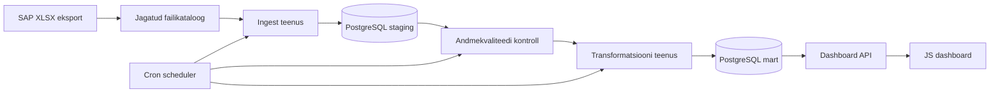

# Andmeinseneeria projekt — võlgnevuste analüüsi andmetoru

## Docker Quickstart
1. `cp .env.example .env`
    * tulemus: sul on repo root kaustas .env fail
2. `unzip docs/aruanne.zip`
    * tulemus: kataloog 'aruanne' koos raportitega on repo root kaustas
3. `docker compose up`
    * tulemus: loodud ja valmis pandud andmebaas, andmetoru jookseb automaatselt peale andmebaasi valmisolekut
4. `docker compose run pipeline`: andmetoru jookseb uuesti
5. `docker compose exec -it postgres psql -U debtuser -d debtdb`: andmebaasis toimetamiseks
6. `docker compose exec -it postgres psql -U debtuser -d debtdb -c 'select * from mart.fact_debt_snapshot'`: laenulepingu faktitabel
7. `docker compose exec -it postgres psql -U debtuser -d debtdb -c 'select * from mart.kpi_daily_debt'`: laenuportfelli ülevaade kuu lõikes
8. `docker compose down -v --remove-orphans`: eemalda volüümid ja andmetoru käsitsi käivitamisel loodud konteinerid

## Äriküsimus

Projekt lahendab probleemi, kus ettevõttel puudub automaatne ja ajas võrreldav ülevaade laenuklientide võlgnevustest. SAP-ist saabub regulaarselt XLSX-fail võlaandmetega ning lahendus laadib selle PostgreSQL-i, kontrollib andmekvaliteeti, arvutab KPI-d ja kuvab tulemused dashboardil.

Peamine äriküsimus:

> Kuidas muutuvad võlas olevate lepingute võlapäevad ja võlasummad ajas ning millised trendid viitavad maksekäitumise halvenemisele?

## Mõõdikud

1. Kaalutud keskmine võlapäevade arv: `SUM(võlapäevad * võlasumma) / SUM(võlasumma)`
2. Maksimaalne võlapäevade arv: `MAX(võlapäevad)`
3. Võlas olevate lepingute arv: `COUNT(leping_id) WHERE võlapäevad > 0`
4. Võlasumma ajas: `SUM(võlasumma) GROUP BY raporti_kuupäev`
5. Ettevõtete arv võlas: `COUNT(DISTINCT registrikood) WHERE võlasumma > 0`

## Arhitektuur



Üldine arhitektuurikirjeldus: [`docs/arhitektuur.md`](docs/arhitektuur.md)

Detailne arhitektuuridokumentatsioon:

- Äriarhitektuur: [`docs/ari_arhitektuur/`](docs/ari_arhitektuur/)
- IT-arhitektuur: [`docs/it_arhitektuur/`](docs/it_arhitektuur/)

## Andmestik

| Allikas | Tüüp | Ajas muutuv? | Roll |
|---|---|---|---|
| SAP võlaandmete eksport | XLSX | Jah, iga päev või kokkulepitud sagedusega | Sisaldab laenuklientide võlasummasid ja võlapäevade infot. |

Sisendfaili peamised veerud:

| Väli | Kirjeldus |
|---|---|
| `REG kood` | Ettevõtte registrikood. |
| `Lepingu nr` | Lepingu number. |
| `Summa` | Võlasumma. |
| `Võlapäevad` | Võlapäevade arv, kui see tuleb allikast. |

## Stack

| Komponent | Tööriist |
|---|---|
| Andmebaas | PostgreSQL |
| Sissevõtt | Python või Node.js teenus |
| Andmekvaliteet | SQL, Python või Node.js kontrollid |
| Transformatsioon | SQL, Python või dbt-stiilis SQL |
| Orkestreerimine | Cron Docker konteineris |
| Dashboard API | Node.js + Express või muu lihtne HTTP API |
| Dashboard | HTML, CSS, Vanilla JavaScript, Chart.js |
| Käitus | Docker Compose mikro-teenused |

## Andmevoog lühidalt

1. SAP salvestab uue XLSX-faili jagatud kataloogi.
2. Scheduler kontrollib uut faili ja käivitab ingest teenuse.
3. Ingest kontrollib faili kontrollsummat ning laadib read `staging` kihti.
4. Quality teenus kontrollib kohustuslikke välju, registrikoodi, lepingu numbrit, võlasummat ja võlapäevi.
5. Transform teenus täidab `mart` skeemi dimensioonid, faktitabeli ja KPI tabelid.
6. Dashboard API loeb mart kihist KPI-d.
7. JS dashboard kuvab trendid ja viimase laadimise staatuse.

## Andmekvaliteedi kontrollid

Projekt kontrollib vähemalt järgmist:

1. Registrikood on täidetud ja vastab kokkulepitud formaadile.
2. Lepingu number on täidetud.
3. Võlasumma on arvuline ega ole mart kihis negatiivne.
4. Võlapäevad on mitte-negatiivne täisarv, kui väli on failis olemas.
5. Sama failikontrollsummaga faili ei laadita duplikaadina.
6. Vigased read salvestatakse `quality` või `logs` skeemi koos vea põhjusega.

## Käivitamine

Rakenduskoodi ja `docker compose` faili ei ole selles etapis veel loodud. Arhitektuur on koostatud nii, et järgmise sammuna saab luua teenused:

```bash
docker compose up -d --build
```

Eeldatav dashboardi aadress pärast rakenduse loomist:

```text
http://localhost:3000
```

## Saladused ja konfiguratsioon

Kõik saladused, paroolid ja keskkonnapõhised väärtused peavad olema `.env` failis. Reposse tohib lisada ainult `.env.example`.

Vajalikud muutujad:

| Muutuja | Tähendus |
|---|---|
| `POSTGRES_HOST` | PostgreSQL host. |
| `POSTGRES_PORT` | PostgreSQL port. |
| `POSTGRES_DB` | Andmebaasi nimi. |
| `POSTGRES_USER` | Andmebaasi kasutaja. |
| `POSTGRES_PASSWORD` | Andmebaasi parool. |
| `SAP_FILES_DIR` | SAP XLSX failide kataloog. |
| `LOG_DIR` | Pipeline logide kataloog. |

## Projekti struktuur

```text
.
├── README.md
├── .gitignore
├── docs/
│   ├── arhitektuur.md
│   ├── ari_arhitektuur/
│   │   ├── 01_arikirjeldus.md
│   │   ├── 02_arireeglistik.md
│   │   ├── 03_arinfo_mudel.md
│   │   ├── 04_ontoloogia_mudel.md
│   │   ├── 05_relatsiooniline_postgresql_andmemudel.md
│   │   ├── 06_analuutiline_andmemudel.md
│   │   ├── 07_dimensionaalne_andmemudel.md
│   │   └── 08_dokumendi_mudel.md
│   └── it_arhitektuur/
│       ├── 01_kasutusmallid.md
│       ├── 02_komponent_diagram.md
│       ├── 03_evitus_diagram.md
│       ├── 04_jargnevus_diagram.md
│       └── 05_kommunikatsiooni_diagram.md
└── TMP/
    ├── UT_IT.txt
    └── codex_arhitektuuri_juhend.md
```

`TMP/` on töökaust lähte- ja juhendmaterjalide jaoks ning seda ei lisata Giti.

## Kokkuvõte, puudused ja võimalikud edasiarendused

**Kokkuvõte:**

- Koostatud on äri- ja IT-arhitektuuri Markdown dokumentatsioon.
- Kirjeldatud on SAP XLSX failist lähtuv automaatne andmetoru.
- Paika on pandud PostgreSQL skeemid, KPI-d, kvaliteedikontrollid ja dashboardi vajadused.

**Puudused:**

- Rakenduskood, Docker Compose fail ja tegelikud teenused on veel loomata.
- SAP faili täpne formaat ja võlapäevade arvutuse allikas vajavad kinnitamist.

**Mis edasi:**

- Luua `compose.yml`, `.env.example` ja teenuste kaustad.
- Ehitada ingest, quality, transform ja dashboard teenused.
- Lisada testandmed ning automaatsed andmekvaliteedi testid.
- Planeerida tulevane ML riskiskoori komponent.

## Meeskond

| Nimi | Roll Sprint 1|
|---|---|
| Jaan | Andmed |
| Joosep | Git |
| Sorell | Testid ja analüüs |
| Anti | Arhitektuur |
