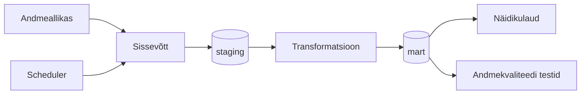

# Arhitektuur

## Äriküsimus

Kuidas muutuvad võlas olevate lepingute võlapäevad ajas ning millised trendid ilmenvad keskmise ja maksimaalse võlapäevade arvu põhjal?

## Mõõdikud

1. Kaalutud keskmine võlapäevade arv — arvutatakse valemiga SUM(võlapäevad * võlasumma) / SUM(võlasumma).
Näitab keskmist võlapäevade arvu, kus suurema võlasummaga lepingud mõjutavad tulemust rohkem.
2. Maksimaalne võlapäevade arv — arvutatakse valemiga MAX(võlapäevad).
Näitab kõige pikema viivitusega aktiivse lepingu võlapäevade arvu valitud perioodil.
3. Võlas olevate lepingute arv — arvutatakse valemiga COUNT(leping_id) WHERE võlapäevad > 0.
Näitab aktiivsete võlas olevate lepingute koguarvu ajaperioodi lõikes.

## Andmeallikad

| Allikas | Tüüp | Ajas muutuv? | Roll |
|---------|------|--------------|------|
| [Nimi] | CSV | Jah, iga päev | Analüüsida võlgades olevaid ettevõtteid |

## Andmevoog

> Täpsusta diagrammi vastavalt oma projektile — lisa rohkem andmeallikaid, mudeleid või teenuseid.

## Andmebaasi kihid

| Kiht | Roll |
|------|------|
| `staging` | Hoiab allika andmeid töötlemata kujul. |
| `mart` | Hoiab transformeeritud ja ärilogikat sisaldavaid tabeleid. |

## Tööjaotus

| Roll | Vastutus | Täitja |
|------|----------|--------|
| Andmeallika omanik | Kirjutab sissevõtu loogika, hoiab API-t töös | [Nimi] |
| Transformatsioonide omanik | Kirjutab mart kihi mudelid ja mõõdikute arvutuse | [Nimi] |
| Kvaliteedi omanik | Kirjutab testid ja vaatab läbi ebaõnnestunud kontrollid | [Nimi] |
| Näidikulaua omanik | Ehitab näidikulaua ja seob selle äriküsimusega | [Nimi] |

## Riskid

| Risk | Mõju | Maandus |
|------|------|---------|
| Andmete formaat võib muutuda | Ingest või transformatsioonid võivad katkeda | Skeemikontrollid ja dbt testid |
| Andmed sisaldavad tundlikku infot | Võib tekkida andmeleke või privaatsusrisk | Anonümiseerimine ja agregatsioonid |
| Ajaloolised andmed võivad olla puudulikud | Trendianalüüs võib olla ebatäpne | Kvaliteedikontrollid ja puuduvate päevade märgistamine |

## Privaatsus ja turve

Projekt kasutab ettevõtte sisemisi andmeid, mis võivad sisaldada tundlikke lepingu- ja kliendiandmeid.
Kõik isikuandmed anonümiseeritakse enne analüüsi. Dashboardides kasutatakse ainult agregeeritud andmeid.
Andmebaasi paroolid ja API võtmed hoitakse .env failis ning repos kasutatakse ainult .env.example faili.