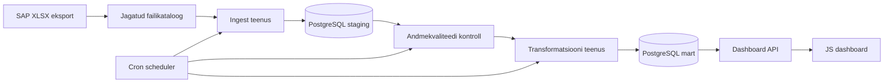

# Arhitektuur

## Eesmärk

Dokument annab kokkuvõtliku ülevaate võlgnevuste analüüsi lahenduse arhitektuurist. Detailsemad mudelid, diagrammid ja tehnilised otsused on eraldi äri- ja IT-arhitektuuri dokumentides.

## Detailne dokumentatsioon

Äriarhitektuur:

- [`ari_arhitektuur/01_arikirjeldus.md`](ari_arhitektuur/01_arikirjeldus.md)
- [`ari_arhitektuur/02_arireeglistik.md`](ari_arhitektuur/02_arireeglistik.md)
- [`ari_arhitektuur/03_arinfo_mudel.md`](ari_arhitektuur/03_arinfo_mudel.md)
- [`ari_arhitektuur/04_ontoloogia_mudel.md`](ari_arhitektuur/04_ontoloogia_mudel.md)
- [`ari_arhitektuur/05_relatsiooniline_postgresql_andmemudel.md`](ari_arhitektuur/05_relatsiooniline_postgresql_andmemudel.md)
- [`ari_arhitektuur/06_analuutiline_andmemudel.md`](ari_arhitektuur/06_analuutiline_andmemudel.md)
- [`ari_arhitektuur/07_dimensionaalne_andmemudel.md`](ari_arhitektuur/07_dimensionaalne_andmemudel.md)
- [`ari_arhitektuur/08_dokumendi_mudel.md`](ari_arhitektuur/08_dokumendi_mudel.md)

IT-arhitektuur:

- [`it_arhitektuur/01_kasutusmallid.md`](it_arhitektuur/01_kasutusmallid.md)
- [`it_arhitektuur/02_komponent_diagram.md`](it_arhitektuur/02_komponent_diagram.md)
- [`it_arhitektuur/03_evitus_diagram.md`](it_arhitektuur/03_evitus_diagram.md)
- [`it_arhitektuur/04_jargnevus_diagram.md`](it_arhitektuur/04_jargnevus_diagram.md)
- [`it_arhitektuur/05_kommunikatsiooni_diagram.md`](it_arhitektuur/05_kommunikatsiooni_diagram.md)

## Äriküsimus

Kuidas muutuvad võlas olevate lepingute võlapäevad ja võlasummad ajas ning millised trendid viitavad maksekäitumise halvenemisele?

## Põhimõõdikud

| Mõõdik | Valem | Selgitus |
|---|---|---|
| Kaalutud keskmine võlapäevade arv | `SUM(võlapäevad * võlasumma) / SUM(võlasumma)` | Suurema võlasummaga lepingud mõjutavad keskmist rohkem. |
| Maksimaalne võlapäevade arv | `MAX(võlapäevad)` | Näitab kõige pikema viivitusega lepingut. |
| Võlas olevate lepingute arv | `COUNT(leping_id) WHERE võlapäevad > 0` | Näitab aktiivsete võlas lepingute arvu. |
| Võlasumma ajas | `SUM(võlasumma) GROUP BY raporti_kuupäev` | Näitab võlgnevuste rahalist trendi. |
| Ettevõtete arv võlas | `COUNT(DISTINCT registrikood) WHERE võlasumma > 0` | Näitab mõjutatud klientide arvu. |

## Andmeallikas

| Allikas | Tüüp | Ajas muutuv? | Roll |
|---|---|---|---|
| SAP võlaandmete eksport | XLSX | Jah | Igapäevane või kokkulepitud sagedusega lähtefail laenuklientide võlgnevuste kohta. |

Fail sisaldab vähemalt registrikoodi, lepingu numbrit ja võlasummat. Võlapäevad võivad tulla failist või olla arvutatavad maksetähtaja ja raportikuupäeva alusel.

## Andmevoog

## Andmebaasi kihid

| Skeem | Roll |
|---|---|
| `staging` | Hoiab SAP failide metaandmeid ja töötlemata ridu. |
| `quality` | Hoiab andmekvaliteedi kontrollide tulemusi. |
| `mart` | Hoiab dimensionaalset mudelit, faktitabelit ja KPI koondeid. |
| `logs` | Hoiab pipeline käivituste, staatuste ja vigade infot. |

## Teenused

| Teenus | Vastutus |
|---|---|
| `postgres` | PostgreSQL andmebaas. |
| `ingest` | Loeb uue SAP XLSX faili, kontrollib duplikaate ja laadib toorread staging kihti. |
| `quality` | Kontrollib kohustuslikke välju, formaate ja väärtusi. |
| `transform` | Teisendab andmed mart kihti ja arvutab KPI-d. |
| `scheduler` | Käivitab croniga päevase töövoo kindlas järjekorras. |
| `dashboard` | Kuvab KPI-d ja laadimise staatuse veebiliideses. |

## Töövoo Järjekord

1. Kontrolli uue faili olemasolu.
2. Käivita ingest.
3. Käivita kvaliteedikontrollid.
4. Käivita transformatsioonid.
5. Uuenda mart kiht.
6. Logi töö tulemus.

## Tööjaotus

| Vastutus | Täitja |
|---|---|
| Andmed | Jaan |
| Git | Joosep |
| Testid ja analüüs | Sorell |
| Arhitektuur | Anti |

## Riskid

| Risk | Mõju | Maandus |
|---|---|---|
| SAP faili formaat muutub | Ingest või kvaliteedikontroll võib katkeda. | Säilitada algne JSON payload ja teha skeemikontrollid. |
| Võlapäevade definitsioon pole kinnitatud | KPI-d võivad olla valesti tõlgendatud. | Kinnitada, kas võlapäevad tulevad failist või arvutatakse. |
| Sama fail laaditakse mitu korda | KPI-d võivad dubleeruda. | Kasutada faili kontrollsummat ja unikaalseid piiranguid. |
| Vigased read jõuavad mart kihti | Dashboard võib näidata valeinfot. | Eraldada vigased read `quality` skeemi ja mart kihis kasutada rangemaid constraint'e. |
| Ajaloolised failid on puudulikud | Trendianalüüs võib olla ebatäpne. | Märgistada puuduvad päevad ja kirjeldada backfill reeglid. |

## Privaatsus Ja Turve

Projekt kasutab ettevõtte sisemisi lepingu- ja kliendiandmeid. Dashboardis tuleks eelistada agregeeritud vaateid ning ligipääs tuleb vajadusel kaitsta autentimise ja rollipõhiste õigustega. Andmebaasi paroolid ja muud saladused peavad olema `.env` failis, mida Giti ei lisata.

## Avatud Küsimused

1. Kas sisendfail on alati XLSX?
2. Kas võlapäevad tulevad failist või arvutatakse maksetähtaja ja raportikuupäeva põhjal?
3. Kas ühe lepingu kohta võib samal päeval olla mitu rida?
4. Kas dashboard vajab autentimist?
5. Kui kaua tuleb toorfaile ja laadimisajalugu säilitada?
6. Kas tulevane ML komponent peab olema eraldi teenus?
