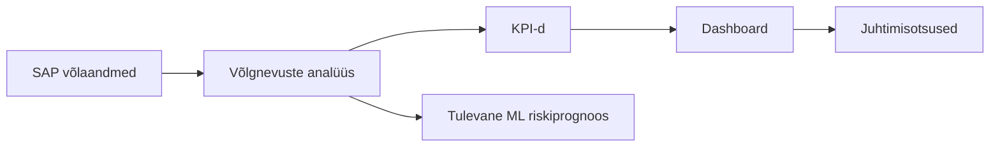

# Ärikirjeldus

## Eesmärk

Dokumendi eesmärk on kirjeldada võlgnevuste analüüsi lahenduse ärilist vajadust, väärtust ja peamisi mõõdikuid. Lahendus peab andma ülevaate sellest, kuidas SAP-ist saabuvate laenuklientide võlgnevuste summa ja võlapäevad ajas muutuvad.

## Ulatus

Ulatus hõlmab SAP-i XLSX ekspordist lähtuvat automaatset andmetoru, PostgreSQL-is tehtavat kontrolli ja teisendust ning dashboardi, mis kuvab juhtimisotsuste jaoks vajalikke KPI-sid. Ulatusse kuulub ka tulevase ML-riskiprognoosi arvestamine arhitektuuris.

## Põhikirjeldus

Ettevõttel on vaja regulaarset ülevaadet laenuklientide võlgnevustest. SAP salvestab jagatud kataloogi iga päev XLSX-faili, mis sisaldab vähemalt registrikoodi, lepingu numbrit, võlasummat ja võlapäevade või võlgnevuse vanuse infot. Käsitsi faili avamine ja trendide hindamine ei ole piisavalt töökindel ega skaleeruv.

Lahendus automatiseerib faili sissevõtu, kvaliteedikontrolli, transformatsiooni ja dashboardi uuendamise. Äriväärtus tekib sellest, et analüütik ja juht näevad võlgnevuste dünaamikat ajas, leiavad halveneva maksekäitumisega ettevõtted ning saavad kiiremini otsustada, kas on vaja sekkuda.

Peamised kasutajad on analüütik, andmeomanik, juht, arendaja, arhitekt ja süsteemiadministraator. Kasusaajad on krediidiriski juhtimine, finantsjuhtimine ja kliendihaldusega seotud üksused.

## Põhilised KPI-d

| KPI | Valem | Äriväärtus |
|---|---|---|
| Kaalutud keskmine võlapäevade arv | `SUM(võlapäevad * võlasumma) / SUM(võlasumma)` | Näitab, kas suurema rahalise mõjuga võlad liiguvad pikemasse viivitusse. |
| Maksimaalne võlapäevade arv | `MAX(võlapäevad)` | Toob välja kõige kriitilisema viivituse. |
| Võlas olevate lepingute arv | `COUNT(leping_id) WHERE võlapäevad > 0` | Näitab probleemi ulatust lepingute arvuna. |
| Võlasumma ajas | `SUM(võlasumma) GROUP BY raporti_kuupäev` | Näitab rahalist trendi. |
| Ettevõtete arv võlas | `COUNT(DISTINCT registrikood) WHERE võlasumma > 0` | Näitab, kui paljusid kliente võlgnevus puudutab. |

## Dashboardi Kasutus

Dashboard kuvab võlapäevade kaalutud keskmise, maksimaalse võlapäevade arvu, võlas olevate lepingute arvu, võlasumma trendi, võlas ettevõtete arvu ning viimase faili laadimise staatuse. Analüütik kasutab dashboardi trendide jälgimiseks, juht koondvaateks ja andmeomanik kvaliteediprobleemide märkamiseks.

## Ärivaate Diagramm

## Tuleviku ML Võimalused

Arhitektuur peab võimaldama lisada ML riskiskoori, maksekäitumise trendiprognoosi ja anomaaliate tuvastamist. Selleks tuleb mart kihis säilitada päevase snapshoti ajalugu ning lisada vajadusel tunnuseid nagu eelmise perioodi võlasumma, võlapäevade muutus ja korduvate hilinemiste arv.

## Tehnilised Märkused

Lahendus kasutab PostgreSQL-i, Docker Compose mikro-teenuseid, cron schedulerit, lihtsat HTTP API-t ja JavaScripti dashboardi. Dokumentatsioonis ei käsitleta Airflow'd, Supersetit ega Streamlitit kohustusliku osana.

## Küsimused mis vajavad vastamist.

1. Kas sisendfail on alati XLSX? Alati on xlsx.
2. Kas võlapäevad tulevad failist või arvutatakse maksetähtaja ja raportikuupäeva põhjal? Võlapäevad on algfailis toodud.
3. Kas ühe lepingu kohta võib samal päeval olla mitu rida? Jah, tavaliselt ongi.
4. Kas andmetes on ainult juriidilised isikud või ka füüsilised isikud? Reaalses situatsioonis mõlemad. Projektitöös on need koodid muudetud ja seetõttu eristus jur. vs füüs. isik ei ole võimalik.
5. Kas dashboard vajab autentimist? Ei.
6. Kui kaua tuleb toorfaile ja laadimisajalugu säilitada? Staging tabelid jm 7 päeva.
7. Kas vigased read tuleb parandada käsitsi või välistada automaatselt? Käsitsi parandada.
8. Kas backfill peab toetama ühe päeva, perioodi või kogu ajaloo uuesti laadimist? Käsitsi käivitamisel laetakse korraga üks päev.
9. Kas tulevane ML komponent peab olema eraldi teenus? Eraldi teenus.
10. Kas vajalik on teavitamine e-posti, Slacki või muu kanali kaudu? E-posti kaudu.
