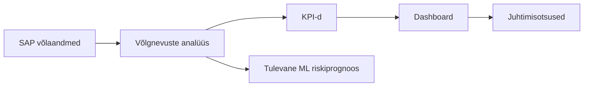

# Ärikirjeldus

## Eesmärk

Dokumendi eesmärk on kirjeldada võlgnevuste analüüsi lahenduse ärilist vajadust, väärtust ja peamisi mõõdikuid. Lahendus peab andma ülevaate sellest, kuidas SAP-ist saabuvate laenuklientide võlgnevuste summa ja võlapäevad ajas muutuvad.

## Ulatus

Ulatus hõlmab SAP-i XLSX ekspordist lähtuvat automaatset andmetoru, PostgreSQL-is tehtavat kontrolli ja teisendust ning dashboardi, mis kuvab juhtimisotsuste jaoks vajalikke KPI-sid. Ulatusse kuulub ka tulevase ML-riskiprognoosi arvestamine arhitektuuris.

## Põhikirjeldus

Ettevõttel on vaja regulaarset ülevaadet laenuklientide võlgnevustest. SAP salvestab jagatud kataloogi iga päev XLSX-faili, mis sisaldab vähemalt registrikoodi, lepingu numbrit, võlasummat ja võlapäevade või võlgnevuse vanuse infot. Käsitsi faili avamine ja trendide hindamine ei ole piisavalt töökindel ega skaleeruv.

Lahendus automatiseerib faili sissevõtu, kvaliteedikontrolli, transformatsiooni ja dashboardi uuendamise. Äriväärtus tekib sellest, et analüütik ja juht näevad võlgnevuste dünaamikat ajas, leiavad halveneva maksekäitumisega ettevõtted ning saavad kiiremini otsustada, kas on vaja sekkuda.

Peamised kasutajad on analüütik, andmeomanik, juht, arendaja, arhitekt ja süsteemiadministraator. Kasusaajad on krediidiriski juhtimine, finantsjuhtimine ja kliendihaldusega seotud üksused.

## Põhilised KPI-d

| KPI | Valem | Äriväärtus |
|---|---|---|
| Kaalutud keskmine võlapäevade arv | `SUM(võlapäevad * võlasumma) / SUM(võlasumma)` | Näitab, kas suurema rahalise mõjuga võlad liiguvad pikemasse viivitusse. |
| Maksimaalne võlapäevade arv | `MAX(võlapäevad)` | Toob välja kõige kriitilisema viivituse. |
| Võlas olevate lepingute arv | `COUNT(leping_id) WHERE võlapäevad > 0` | Näitab probleemi ulatust lepingute arvuna. |
| Võlasumma ajas | `SUM(võlasumma) GROUP BY raporti_kuupäev` | Näitab rahalist trendi. |
| Ettevõtete arv võlas | `COUNT(DISTINCT registrikood) WHERE võlasumma > 0` | Näitab, kui paljusid kliente võlgnevus puudutab. |

## Dashboardi Kasutus

Dashboard kuvab võlapäevade kaalutud keskmise ajas, võlas olevate ettevõtete ja lepingute arvu ning viimase viie raportikuupäeva ettevõttepõhise võlapäevade koondi. Analüütik kasutab dashboardi trendide jälgimiseks, juht koondvaateks ja andmeomanik kvaliteediprobleemide märkamiseks.

Praegune teostus pakub eraldi vaateid üldisele dashboardile, kaalutud keskmise graafikule, võlas olevate ettevõtete/lepingute arvu graafikule ja võlgnevuste raportile. Andmed tulevad mart kihi vaadetest `mart.v_overdues_summary`, `mart.v_overdues_counts`, `mart.v_overdues_last5_dates` ja `mart.v_overdues_company_pivot_last5`.

## Ärivaate Diagramm

## Tuleviku ML Võimalused

Arhitektuur peab võimaldama lisada ML riskiskoori, maksekäitumise trendiprognoosi ja anomaaliate tuvastamist. Selleks tuleb mart kihis säilitada päevase snapshoti ajalugu ning lisada vajadusel tunnuseid nagu eelmise perioodi võlasumma, võlapäevade muutus ja korduvate hilinemiste arv.

## Tehnilised Märkused

Lahendus kasutab PostgreSQL-i, Docker Compose teenuseid, Python/Flask HTTP API-t ja JavaScripti dashboardi. Pipeline käivitatakse kas scheduler teenuse kaudu või käsitsi `trigger_pipeline` teenusena. Dokumentatsioonis ei käsitleta Airflow'd, Supersetit ega Streamlitit kohustusliku osana.

