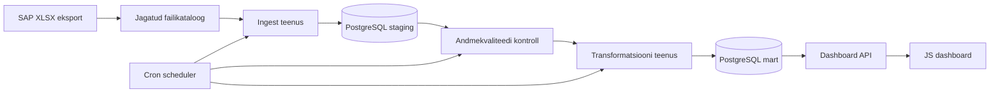

# Ärireeglistik

## Eesmärk

Dokumendi eesmärk on kirjeldada võlgnevuste andmetoru ärireeglid, mida tuleb rakendada sissevõtus, kvaliteedikontrollis, transformatsioonides ja dashboardi KPI-des.

## Ulatus

Ulatus hõlmab SAP XLSX faili ridu, failide metaandmeid, duplikaatide käsitlust, kvaliteedikontrolle, backfilli ja KPI-de arvutust.

## Põhikirjeldus

Võlas leping on leping, mille võlapäevade arv on suurem kui null või mille võlasumma on positiivne ja ärireegel kinnitab, et summa on tähtajaks tasumata. Võlasumma on SAP-ist saabuv rahaline väärtus, mida kasutatakse kaalutud keskmise arvutuses. Võlapäevad näitavad viivituse pikkust päevades.

## Reeglite Tabel

| Reegel | Kirjeldus | Rakenduskoht | Märkus |
|---|---|---|---|
| Võlas lepingu definitsioon | Leping on võlas, kui `võlapäevad > 0`. Kui võlapäevade väli puudub või on 0, käsitletakse rida kui mitte-võlas ja seda ei kaasata võlasummade koonditesse. | `mart.fact_debt_snapshot`, KPI vaated | Puuduv võlapäevade väli tähendab tavaliselt, et summa ei ole veel võlas (tähtaeg on aruande kuupäev). |
| Võlasumma definitsioon | Võlasumma on tasumata summa numbrilise väärtusena. | ingest, quality, transform | Negatiivne summa vajab eraldi märgistamist. |
| Võlapäevade definitsioon | Võlapäevad on päevade arv maksetähtaja ületamisest. Võlapäevade väli võetakse eelistatult failist; kui väli puudub, loetakse võlapäevadeks 0 ja rida ei kuulu "võlas" klassi. | quality, transform | Kui väli puudub, tähendab see tihti, et summa on alles tähtaegne ning seda võib kõrvale jätta koonditelt. |
| Kaalutud keskmine | `SUM(võlapäevad * võlasumma) / SUM(võlasumma)`. | mart KPI vaade | Jagamine nulliga välditakse `NULLIF` abil. |
| Maksimaalne võlapäevade arv | `MAX(võlapäevad)`. | mart KPI vaade | Arvutatakse valitud perioodi või snapshoti kohta. |
| Võlas lepingute arv | `COUNT(leping_id) WHERE võlapäevad > 0`. | dashboard API | Vajab lepingu unikaalset võtit. |
| Faili sissevõtt | Uus fail loetakse sisse ainult siis, kui kontrollsumma ei ole varem laaditud. | ingest | Failinimi üksi ei ole piisav unikaalsuse alus. |
| Duplikaatide käsitlus | Sama failikontrollsummaga faili ei laadita uuesti. | staging.ingested_files | Backfill võib lubada teadlikku taaslaadimist. |
| Vigased read | Vigased read salvestatakse kvaliteeditulemusega ja neid mart kihti ei kanta. | quality | Vajalik on vea põhjus. |
| Backfill | Ajaloolisi faile saab taas töödelda päeva, perioodi või kogu ajaloo lõikes. | scheduler, ingest, transform | Täpne ulatus on avatud küsimus. |
| Registrikoodi kontroll | Registrikood peab vastama kokkulepitud formaadile. | quality | Eesti juriidilise isiku puhul üldjuhul 8 numbrit. |
| Lepingu numbri kontroll | Lepingu number peab olema täidetud. | quality | Puuduv leping takistab lepingupõhist analüüsi. |
| Võlasumma kontroll | Võlasumma peab olema arvuline. | quality | Tühjad ja mittearvulised väärtused eraldatakse. |
| Võlapäevade kontroll | Võlapäevad peavad olema mitte-negatiivne täisarv, kui väli on failis olemas. | quality | Negatiivsed väärtused märgitakse veaks. |

## Andmevoog

## Tehnilised Märkused

Ärireeglid tuleb realiseerida nii SQL-is kui ka teenuste valideerimisloogikas. Reeglite tulemused salvestatakse `quality` või `logs` skeemi, et dashboard saaks näidata failide laadimise staatust ja vigade arvu.

