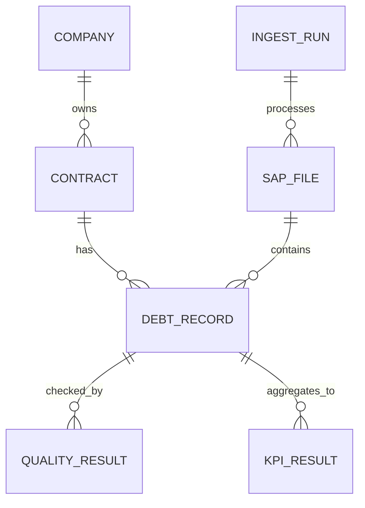

# Äriinfo Mudel

## Eesmärk

Dokumendi eesmärk on kirjeldada võlgnevuste analüüsi peamised äriobjektid ja nende seosed.

## Ulatus

Ulatus hõlmab ettevõtet, lepingut, võlakirjet, SAP faili, sissevõtu tööd, kvaliteedikontrolli, KPI-d ja dashboardi.

## Põhikirjeldus

Äriinfo mudeli keskne objekt on võlakirje, mis seob ettevõtte, lepingu, raportikuupäeva, võlasumma ja võlapäevad. Võlakirjed pärinevad SAP failist ning neid töödeldakse sissevõtu ja kvaliteedikontrolli kaudu. KPI-d tekivad võlakirjete koondamisel päevaseks analüütiliseks vaateks.

| Äriobjekt | Kirjeldus | Olulised atribuudid |
|---|---|---|
| Ettevõte | Laenuklient või võlas olev osapool. | registrikood, nimi |
| Leping | Ettevõttega seotud laenuleping. | lepingu number, registrikood |
| Võlakirje | Ühe lepingu võlaolukord raportikuupäeval. Kui algfailis puudub `võlapäevad`, tähendab see tavaliselt, et summa pole veel võlas (tähtaeg on aruande kuupäev) ning seda rida ei kaasata võlasummade koonditesse. | võlasumma, võlapäevad, raportikuupäev |
| SAP fail | Allikafail, mis sisaldab võlaandmeid. | failinimi, kontrollsumma, raportikuupäev |
| Sissevõtu töö | Faili laadimise käivitus. | algus, lõpp, staatus |
| Kvaliteedikontroll | Rea või faili valideerimise tulemus. | reegel, staatus, veateade |
| KPI | Koondmõõdik dashboardile. | mõõdiku nimi, väärtus, kuupäev |
| Dashboard | Kasutajaliides KPI-de ja trendide kuvamiseks. | filtrid, graafikud, laadimise staatus |

## Diagramm

## Tehnilised Märkused

Äriobjektid kaardistuvad PostgreSQL-i tabelitesse. Ettevõte ja leping muutuvad dimensioonideks, võlakirje muutub faktitabeli reaks ning SAP fail muutub faili dimensiooniks ja staging metaandmeteks.

