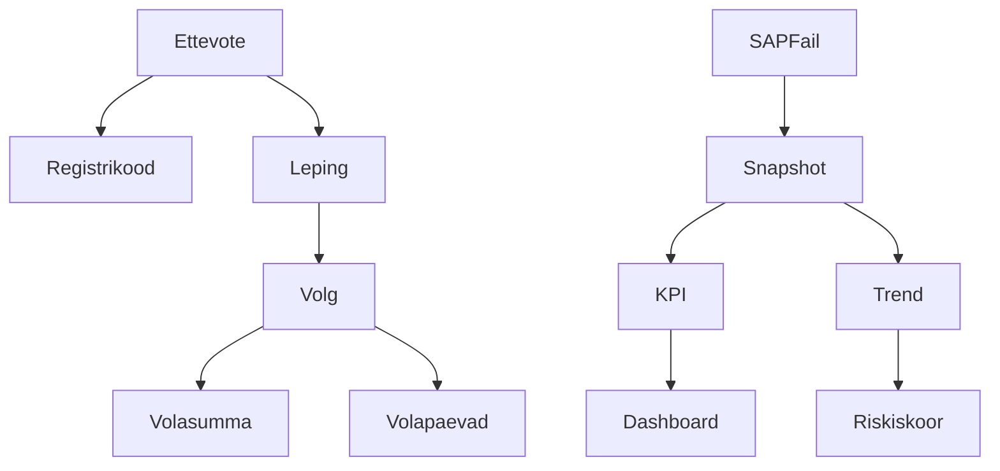

# Ontoloogia Mudel

## Eesmärk

Dokumendi eesmärk on ühtlustada võlgnevuste analüüsi mõisted, et äri- ja IT-osapooled kasutaksid samu definitsioone.

## Ulatus

Ulatus hõlmab mõisteid ettevõte, registrikood, leping, võlg, võlasumma, võlapäev, raportikuupäev, SAP fail, snapshot, KPI, dashboard, riskiskoor ja trend.

## Põhikirjeldus

Ontoloogia kirjeldab, kuidas ärimõisted on omavahel seotud. Ettevõte on tuvastatav registrikoodi kaudu. Ettevõttel võib olla mitu lepingut. Lepingul võib igal raportikuupäeval olla võlg, mille põhiomadused on võlasumma ja võlapäevad. Päevane snapshot koondab SAP failist saadud seisundi ning sellest arvutatakse KPI-d ja trendid.

| Mõiste | Definitsioon |
|---|---|
| Ettevõte | Laenuklient, kelle maksekäitumist jälgitakse. |
| Registrikood | Ettevõtte unikaalne identifikaator. |
| Leping | Ettevõttega seotud laenuleping. |
| Võlg | Lepingu tasumata kohustus raportikuupäeval. |
| Võlasumma | Tasumata rahaline summa. |
| Võlapäev | Päevade arv, mille võrra kohustus on tähtajast üle. |
| Raportikuupäev | Kuupäev, mille kohta SAP fail andmeseisu kirjeldab. |
| SAP fail | XLSX formaadis allikafail võlaandmetega. |
| Snapshot | Päevane fikseeritud andmeseis mart kihis. |
| KPI | Võlgnevuste juhtimiseks kasutatav koondmõõdik. |
| Dashboard | Veebivaade KPI-de ja trendide kuvamiseks. |
| Riskiskoor | Tulevane ML põhine hinnang makseriski kohta. |
| Trend | Ajaline muutus võlasummas või võlapäevades. |

## Diagramm

## Tehnilised Märkused

Diagrammis kasutatakse ASCII-põhiseid sõlme ID-sid, et Mermaid renderdus oleks töökindel. Kasutajale kuvatavates tekstides kasutatakse eesti mõisteid.

