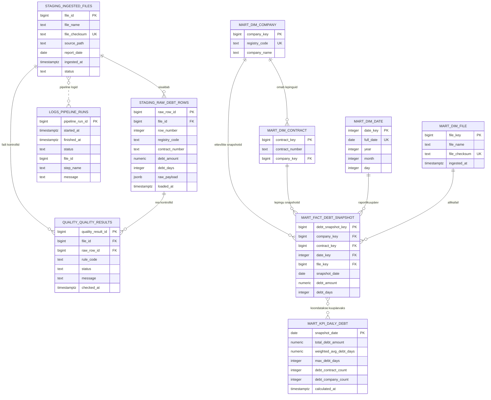

# Relatsiooniline PostgreSQL Andmemudel

## Eesmärk

Dokumendi eesmärk on kirjeldada PostgreSQL skeemid, tabelid, seosed, indeksid ja constraintid, mille abil SAP võlaandmed laaditakse, kontrollitakse ja teisendatakse analüütiliseks kihiks.

## Ulatus

Ulatus hõlmab skeeme `staging`, `quality`, `mart` ja `logs` ning põhitabeleid toorandmete, kvaliteeditulemuste, pipeline logide ja dashboardi mart kihi jaoks.

## Põhikirjeldus

Andmemudel jaguneb neljaks kihiks. `staging` hoiab failide metaandmeid ja toorread. `quality` hoiab valideerimistulemusi. `logs` hoiab töövoo käivituste infot. `mart` hoiab dashboardi ja tulevase ML komponendi jaoks sobivaid dimensioone ja faktitabeleid.

## Skeemid Ja Tabelid

| Skeem | Tabel | Roll |
|---|---|---|
| `staging` | `raw_debt_rows` | SAP failist loetud toorread. |
| `staging` | `ingested_files` | Failide metaandmed ja duplikaadikontroll. |
| `quality` | `quality_results` | Rea- ja failipõhised kvaliteeditulemused. |
| `logs` | `pipeline_runs` | Pipeline käivituste logi. |
| `mart` | `dim_company` | Ettevõtte dimensioon. |
| `mart` | `dim_contract` | Lepingu dimensioon. |
| `mart` | `dim_date` | Kuupäeva dimensioon. |
| `mart` | `dim_file` | Faili dimensioon. |
| `mart` | `fact_debt_snapshot` | Päevane lepingu võlasnapshot. |
| `mart` | `kpi_daily_debt` | Päevased dashboardi KPI-d. |
| `mart` | `v_overdues_summary` | Kaalutud keskmise võlapäevade ja koondarvude vaade. |
| `mart` | `v_overdues_counts` | Võlas olevate ettevõtete ja lepingute arvu vaade. |
| `mart` | `v_overdues_last5_dates` | Viimase viie raportikuupäeva veerupäiste vaade. |
| `mart` | `v_overdues_company_pivot_last5` | Ettevõttepõhine viimase viie kuupäeva võlapäevade pivot. |

## ERD



ERD-l on vaated näidatud tekstis, mitte eraldi olemitena, sest `mart.v_overdues_summary`, `mart.v_overdues_counts`, `mart.v_overdues_last5_dates` ja `mart.v_overdues_company_pivot_last5` on tuletatud `mart.fact_debt_snapshot` tabelist ja dimensioonidest.

## DDL

```sql
-- Minimal schema init for the pipeline (staging, quality, mart, logs)
CREATE SCHEMA IF NOT EXISTS staging;
CREATE SCHEMA IF NOT EXISTS quality;
CREATE SCHEMA IF NOT EXISTS mart;
CREATE SCHEMA IF NOT EXISTS logs;

CREATE TABLE IF NOT EXISTS staging.ingested_files (
    file_id BIGSERIAL PRIMARY KEY,
    file_name TEXT NOT NULL,
    file_checksum TEXT NOT NULL UNIQUE,
    source_path TEXT NOT NULL,
    report_date DATE,
    ingested_at TIMESTAMPTZ DEFAULT now(),
    status TEXT NOT NULL
);

CREATE TABLE IF NOT EXISTS staging.raw_debt_rows (
    raw_row_id BIGSERIAL PRIMARY KEY,
    file_id BIGINT REFERENCES staging.ingested_files(file_id),
    row_number INTEGER NOT NULL,
    registry_code TEXT,
    contract_number TEXT NOT NULL,
    debt_amount NUMERIC(18,2) NOT NULL,
    debt_days INTEGER,
    raw_payload JSONB,
    loaded_at TIMESTAMPTZ DEFAULT now()
);

CREATE TABLE IF NOT EXISTS quality.quality_results (
    quality_result_id BIGSERIAL PRIMARY KEY,
    file_id BIGINT REFERENCES staging.ingested_files(file_id),
    raw_row_id BIGINT REFERENCES staging.raw_debt_rows(raw_row_id),
    rule_code TEXT NOT NULL,
    status TEXT NOT NULL,
    message TEXT,
    checked_at TIMESTAMPTZ DEFAULT now()
);

CREATE TABLE IF NOT EXISTS logs.pipeline_runs (
    pipeline_run_id BIGSERIAL PRIMARY KEY,
    started_at TIMESTAMPTZ NOT NULL DEFAULT now(),
    finished_at TIMESTAMPTZ,
    status TEXT NOT NULL,
    file_id BIGINT,
    step_name TEXT,
    message TEXT
);

CREATE TABLE IF NOT EXISTS mart.dim_company (
    company_key BIGSERIAL PRIMARY KEY,
    registry_code TEXT NOT NULL UNIQUE,
    company_name TEXT
);

CREATE TABLE IF NOT EXISTS mart.dim_contract (
    contract_key BIGSERIAL PRIMARY KEY,
    contract_number TEXT NOT NULL,
    company_key BIGINT NOT NULL REFERENCES mart.dim_company(company_key),
    UNIQUE (contract_number, company_key)
);

CREATE TABLE IF NOT EXISTS mart.dim_date (
    date_key INTEGER PRIMARY KEY,
    full_date DATE NOT NULL UNIQUE,
    year INTEGER NOT NULL,
    month INTEGER NOT NULL,
    day INTEGER NOT NULL
);

CREATE TABLE IF NOT EXISTS mart.dim_file (
    file_key BIGSERIAL PRIMARY KEY,
    file_name TEXT NOT NULL,
    file_checksum TEXT NOT NULL UNIQUE,
    ingested_at TIMESTAMPTZ
);

CREATE TABLE IF NOT EXISTS mart.fact_debt_snapshot (
    debt_snapshot_key BIGSERIAL PRIMARY KEY,
    company_key BIGINT NOT NULL REFERENCES mart.dim_company(company_key),
    contract_key BIGINT NOT NULL REFERENCES mart.dim_contract(contract_key),
    date_key INTEGER NOT NULL REFERENCES mart.dim_date(date_key),
    file_key BIGINT NOT NULL REFERENCES mart.dim_file(file_key),
    snapshot_date DATE NOT NULL,
    debt_amount NUMERIC(18,2) NOT NULL,
    debt_days INTEGER,
    UNIQUE (contract_key, snapshot_date),
    CHECK (debt_days IS NULL OR debt_days >= 0)
);

CREATE TABLE IF NOT EXISTS mart.kpi_daily_debt (
    snapshot_date DATE PRIMARY KEY,
    total_debt_amount NUMERIC(18,2),
    weighted_avg_debt_days NUMERIC(18,4),
    max_debt_days INTEGER,
    debt_contract_count INTEGER,
    debt_company_count INTEGER,
    calculated_at TIMESTAMPTZ DEFAULT now()
);

CREATE OR REPLACE VIEW mart.v_overdues_summary AS
SELECT
fd.snapshot_date,
SUM(fd.debt_amount) AS company_debtsum_total,
ROUND(
SUM(fd.debt_amount * fd.debt_days) / NULLIF(SUM(fd.debt_amount), 0)
) AS weighted_avg_debtdays,
COUNT(DISTINCT fd.company_key) AS company_count,
COUNT(DISTINCT (fd.company_key, fd.contract_key)) AS contract_count
FROM mart.fact_debt_snapshot fd
WHERE fd.debt_days IS NOT NULL
GROUP BY
snapshot_date;


CREATE OR REPLACE VIEW mart.v_overdues_counts
AS SELECT fd.snapshot_date,
    count(DISTINCT fd.company_key) AS company_count,
    count(DISTINCT ROW(fd.company_key, fd.contract_key)) AS contract_count
   FROM mart.fact_debt_snapshot fd
  WHERE fd.debt_days IS NOT NULL
  GROUP BY fd.snapshot_date;


CREATE OR REPLACE VIEW mart.v_overdues_last5_dates
AS SELECT row_number() OVER (ORDER BY snapshot_date) AS col_nr,
    snapshot_date,
    to_char(snapshot_date::timestamp with time zone, 'DD.MM.YYYY'::text) AS snapshot_date_label
   FROM ( SELECT DISTINCT fd.snapshot_date
           FROM mart.fact_debt_snapshot fd
          WHERE fd.debt_days IS NOT NULL
          ORDER BY fd.snapshot_date DESC
         LIMIT 5) d;

CREATE OR REPLACE VIEW mart.v_overdues_company_pivot_last5
AS WITH last_dates AS (
         SELECT d.snapshot_date,
            row_number() OVER (ORDER BY d.snapshot_date) AS rn
           FROM ( SELECT DISTINCT fd.snapshot_date
                   FROM mart.fact_debt_snapshot fd
                  WHERE fd.debt_days IS NOT NULL
                  ORDER BY fd.snapshot_date DESC
                 LIMIT 5) d
        ), pivot_dates AS (
         SELECT max(last_dates.snapshot_date) FILTER (WHERE last_dates.rn = 1) AS d1,
            max(last_dates.snapshot_date) FILTER (WHERE last_dates.rn = 2) AS d2,
            max(last_dates.snapshot_date) FILTER (WHERE last_dates.rn = 3) AS d3,
            max(last_dates.snapshot_date) FILTER (WHERE last_dates.rn = 4) AS d4,
            max(last_dates.snapshot_date) FILTER (WHERE last_dates.rn = 5) AS d5
           FROM last_dates
        )
 SELECT dc.registry_code,
    round(sum(fd.debt_amount * fd.debt_days::numeric) FILTER (WHERE fd.snapshot_date = p.d1) / NULLIF(sum(fd.debt_amount) FILTER (WHERE fd.snapshot_date = p.d1), 0::numeric))::integer AS value_1,
    round(sum(fd.debt_amount * fd.debt_days::numeric) FILTER (WHERE fd.snapshot_date = p.d2) / NULLIF(sum(fd.debt_amount) FILTER (WHERE fd.snapshot_date = p.d2), 0::numeric))::integer AS value_2,
    round(sum(fd.debt_amount * fd.debt_days::numeric) FILTER (WHERE fd.snapshot_date = p.d3) / NULLIF(sum(fd.debt_amount) FILTER (WHERE fd.snapshot_date = p.d3), 0::numeric))::integer AS value_3,
    round(sum(fd.debt_amount * fd.debt_days::numeric) FILTER (WHERE fd.snapshot_date = p.d4) / NULLIF(sum(fd.debt_amount) FILTER (WHERE fd.snapshot_date = p.d4), 0::numeric))::integer AS value_4,
    round(sum(fd.debt_amount * fd.debt_days::numeric) FILTER (WHERE fd.snapshot_date = p.d5) / NULLIF(sum(fd.debt_amount) FILTER (WHERE fd.snapshot_date = p.d5), 0::numeric))::integer AS value_5
   FROM mart.fact_debt_snapshot fd
   JOIN mart.dim_company dc ON fd.company_key=dc.company_key
     CROSS JOIN pivot_dates p
  WHERE fd.debt_days IS NOT NULL
  GROUP BY dc.registry_code, p.d1, p.d2, p.d3, p.d4, p.d5;
```

## Indeksid Ja Constraintid

| Objekt | Soovitus | Põhjus |
|---|---|---|
| `staging.ingested_files.file_checksum` | `UNIQUE` | Takistab sama faili korduslaadimist. |
| `staging.raw_debt_rows(file_id, row_number)` | `UNIQUE` | Tagab rea kordumatuse faili sees. |
| `mart.fact_debt_snapshot(contract_key, snapshot_date)` | `UNIQUE` | Üks rida ühe lepingu ühe raportikuupäeva kohta. |
| `mart.fact_debt_snapshot(snapshot_date)` | indeks | Kiirendab dashboardi ajafiltreid. |
| `mart.dim_company.registry_code` | `UNIQUE` ja indeks | Kiirendab ettevõtte järgi filtreerimist. |
| `debt_amount` | `CHECK (debt_amount >= 0)` mart kihis | Mart kihis ei tohiks olla negatiivseid võlasummasid. |
| `debt_days` | `CHECK (debt_days >= 0)` mart kihis | Võlapäevad ei tohiks olla negatiivsed. |

## Tehnilised Märkused

Staging kihis võib lubada rohkem puudulikke väärtusi, sest kvaliteedikontroll peab suutma vigased read salvestada ja raporteerida. Mart kihis tuleb kasutada rangemaid constraint'e, sest see kiht teenindab dashboardi ja analüütilisi päringuid.

Praegune dashboard loeb lisaks `mart.kpi_daily_debt` tabelile ka mart vaateid `v_overdues_summary`, `v_overdues_counts`, `v_overdues_last5_dates` ja `v_overdues_company_pivot_last5`. Need vaated hoiavad API päringud lihtsad ning eraldavad raporti jaoks vajaliku pivot-loogika veebikihist.

## Viimati skripti käivitamine
- Aeg (UTC): 2026-05-24T13:55:17+00:00
- Kirjeldus: pipeline ingest/transform run

