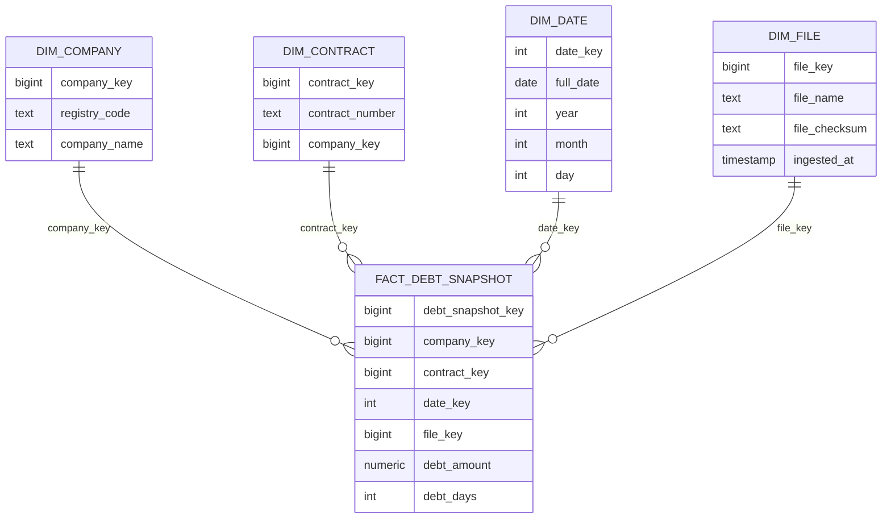

# Dimensionaalne Andmemudel

## Eesmärk

Dokumendi eesmärk on kirjeldada tähtskeemi, mida kasutatakse võlgnevuste analüütilises mart kihis.

## Ulatus

Ulatus hõlmab faktitabelit `mart.fact_debt_snapshot` ning dimensioone `mart.dim_company`, `mart.dim_contract`, `mart.dim_date` ja `mart.dim_file`.

## Põhikirjeldus

Dimensionaalne mudel võimaldab dashboardil ja analüütilistel päringutel kiiresti koondada võlgnevusi ettevõtte, lepingu, kuupäeva ja faili järgi. Faktitabeli granulaarsus on üks rida ühe lepingu ühe raportikuupäeva kohta.

## Granulaarsus

```text
Üks rida ühe lepingu ühe raportikuupäeva kohta.
```

## Tähtskeem



## Tabelid

| Tabel | Tüüp | Kirjeldus |
|---|---|---|
| `mart.fact_debt_snapshot` | Fakt | Võlasumma ja võlapäevad lepingu päevase snapshotina. |
| `mart.dim_company` | Dimensioon | Ettevõtte registrikood ja nimi. |
| `mart.dim_contract` | Dimensioon | Lepingu number ja seos ettevõttega. |
| `mart.dim_date` | Dimensioon | Kuupäev ja kalendri atribuudid. |
| `mart.dim_file` | Dimensioon | SAP faili metaandmed ja sissevõtu aeg. |

## Tehnilised Märkused

`dim_date` võimaldab perioodipõhist filtreerimist ilma kuupäeva arvutusi iga päringu ajal kordamata. `dim_file` võimaldab jälgida, millisest SAP failist konkreetne snapshot pärineb.

## Avatud Küsimused

1. Kas ettevõtte dimensiooni tuleb lisada segment, riskiklass või kliendihaldur? Projektitöös vast ärme lisame; reaalses kasutuses panen hiljem juurde.
2. Kas lepingu dimensioon vajab lepingu alguse ja lõpu kuupäeva? Ei.
3. Kas failid võivad sisaldada mitut raportikuupäeva? Ühes failis on ainult üks raporti kuupäev.
