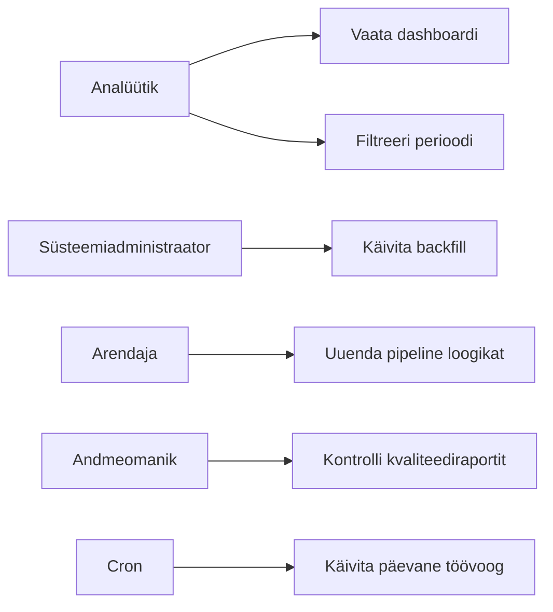

# Kasutusmallid

## Eesmärk

Dokumendi eesmärk on kirjeldada süsteemi rollid ja peamised kasutusmallid.

## Ulatus

Ulatus hõlmab SAP faili laadimist, kvaliteedikontrolli, KPI arvutust, dashboardi, backfilli, logide kontrolli, tulevast ML riskimudelit ja raporti eksporti.

## Rollid

| Roll | Kirjeldus |
|---|---|
| Andmeomanik | Vastutab andmete tähenduse ja kvaliteedinõuete eest. |
| Analüütik | Kasutab dashboardi ja tõlgendab võlgnevuste trende. |
| Arendaja | Arendab ingest, quality, transform ja API teenuseid. |
| Arhitekt | Hoiab lahenduse terviklikku tehnilist suunda. |
| Süsteemiadministraator | Haldab Docker Compose keskkonda, andmebaasi ja logisid. |
| Juht | Kasutab KPI-sid otsuste tegemiseks. |

## Kasutusmallid

| # | Kasutusmall | Peamine roll | Tulemus |
|---|---|---|---|
| 1 | Laadi SAP XLSX fail | Cron scheduler | Uus fail on staging kihis. |
| 2 | Kontrolli andmekvaliteeti | Andmeomanik | Vigased read ja kvaliteedistaatus on teada. |
| 3 | Arvuta KPI-d | Transform teenus | Mart kiht ja KPI tabelid on uuendatud. |
| 4 | Vaata dashboardi | Analüütik, juht | Võlgnevuste trendid on nähtavad. |
| 5 | Tee backfill | Süsteemiadministraator | Ajalooline periood on uuesti töödeldud. |
| 6 | Kontrolli pipeline logisid | Arendaja, administraator | Töövoo staatus ja vead on leitavad. |
| 7 | Lisa tulevane ML riskimudel | Arhitekt, arendaja | Riskiskoor kasutab mart kihi ajalugu. |
| 8 | Ekspordi raport | Analüütik | KPI-d saab jagada välise raportina. |

## Diagramm

## Tehnilised Märkused

Kasutusmallid realiseeritakse Docker Compose teenustena. Päevane automaatne töövoog käivitub cron scheduleris, kuid arendaja või administraator peab saama vajadusel samu samme käsitsi käivitada.

## Küsimused

1. Kas dashboard vajab autentimist? Ei.
2. Kas raporti eksport peab olema CSV, XLSX või PDF? Ei. Graafikud kuvatakse Apache Echart abil (javascript põhine dashboard).
3. Kas vajalik on teavitamine e-posti, Slacki või muu kanali kaudu? Jah, vea korral andmete sisse laadimisel.
