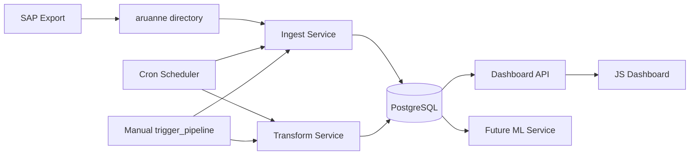

# Komponentdiagramm

## Eesmärk

Dokumendi eesmärk on kirjeldada lahenduse peamised IT komponendid ja nende seosed.

## Ulatus

Ulatus hõlmab SAP eksporti, `aruanne` failikataloogi, schedulerit, käsitsi käivitatavat pipeline triggerit, ingest/quality/transform loogikat, PostgreSQL-i, Flask dashboard API-t, JS frontend'i ja tulevast ML teenust.

## Põhikirjeldus

SAP XLSX fail paikneb `aruanne` kataloogis ning konteineris on see nähtav `/data/aruanne` teena. Scheduler või `trigger_pipeline` käivitab töövoo, mille käigus Python ingest loeb faili PostgreSQL staging kihti, sama protsessi kvaliteediloogika salvestab kontrollitulemused ja transform uuendab mart kihte. Flask API loeb mart kihist KPI-d ning HTML/CSS/JavaScript frontend kuvab need kasutajale. Tulevane ML teenus saab kasutada samu mart tabeleid riskiskoori arvutamiseks.

## Diagramm

## Komponendid

| Komponent | Vastutus | Tehnoloogia |
|---|---|---|
| SAP Export | Tekitab võlaandmete XLSX faili. | SAP |
| Shared File Storage | Hoiab SAP ekspordifaile. | `./aruanne` bind mount konteineris `/data/aruanne` |
| Cron Scheduler | Käivitab töövoo kindlas järjekorras. | Python scheduler Docker konteineris |
| Manual Pipeline Trigger | Võimaldab töövoogu käsitsi käivitada. | Docker Compose profiiliga `trigger_pipeline` |
| Ingest Service | Loeb XLSX faili staging kihti ja salvestab rea kvaliteeditulemused. | Python, pandas, psycopg2 |
| Transform Service | Täidab mart tabelid, teeb mart kontrollid ja arvutab KPI-d. | Python ja SQL |
| PostgreSQL | Hoiab staging, quality, mart ja logs skeeme. | PostgreSQL |
| Dashboard API | Teenindab dashboardi ja JSON päringuid. | Python Flask |
| JS Frontend | Kuvab KPI-d, graafikud ja raportivaate. | HTML, CSS, Apache ECharts, Vanilla JS |
| Future ML Service | Arvutab riskiskoori või trendiprognoosi. | Hilisem eraldi teenus |

## Tehnilised Märkused

Praegune Compose konfiguratsioon kasutab `network_mode: host`, mistõttu teenused pöörduvad PostgreSQL-i poole `localhost:5432` kaudu. API peab lugema eelarvutatud mart andmeid ja vaateid, mitte tegema raskeid transformatsioone kasutaja päringu ajal.

