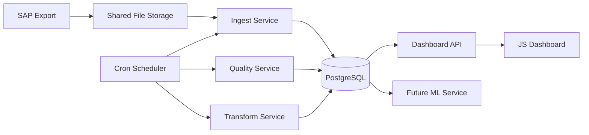

# Komponentdiagramm

## Eesmärk

Dokumendi eesmärk on kirjeldada lahenduse peamised IT komponendid ja nende seosed.

## Ulatus

Ulatus hõlmab SAP eksporti, jagatud failikataloogi, cron schedulerit, ingest teenust, quality teenust, transform teenust, PostgreSQL-i, dashboard API-t, JS frontend'i ja tulevast ML teenust.

## Põhikirjeldus

SAP kirjutab XLSX faili jagatud failikataloogi. Cron scheduler käivitab töövoo, mille käigus ingest teenus loeb faili PostgreSQL staging kihti, quality teenus kontrollib ridu ja transform teenus uuendab mart kihte. Dashboard API loeb mart kihist KPI-d ja JS frontend kuvab need kasutajale. Tulevane ML teenus saab kasutada samu mart tabeleid riskiskoori arvutamiseks.

## Diagramm

## Komponendid

| Komponent | Vastutus | Tehnoloogia |
|---|---|---|
| SAP Export | Tekitab võlaandmete XLSX faili. | SAP |
| Shared File Storage | Hoiab SAP ekspordifaile. | Jagatud kataloog või volume |
| Cron Scheduler | Käivitab töövoo kindlas järjekorras. | cron Docker konteineris |
| Ingest Service | Loeb XLSX faili staging kihti. | Python või Node.js |
| Quality Service | Kontrollib andmekvaliteeti. | SQL, Python või Node.js |
| Transform Service | Täidab mart tabelid ja KPI-d. | SQL, Python või dbt-stiilis SQL |
| PostgreSQL | Hoiab staging, quality, mart ja logs skeeme. | PostgreSQL |
| Dashboard API | Teenindab dashboardi päringuid. | PHP (Node.js + Express) |
| JS Frontend | Kuvab KPI-d ja graafikud. | HTML, CSS, Vanilla JS, Apache Echarts, (Chart.js) |
| Future ML Service | Arvutab riskiskoori või trendiprognoosi. | Hilisem eraldi teenus |

## Tehnilised Märkused

Kõik sisemised teenused suhtlevad Docker Compose võrgus. API peab lugema eelarvutatud mart andmeid, mitte tegema raskeid transformatsioone kasutaja päringu ajal.

## Küsimused

1. Kas tulevane ML komponent peab olema eraldi teenus?
2. Kas API peab toetama ainult dashboardi või ka väliseid süsteeme? Toetab ainult dashboardi (PHP).
3. Kas failikataloog on lokaalne volume või võrguketas? Võrguketas
