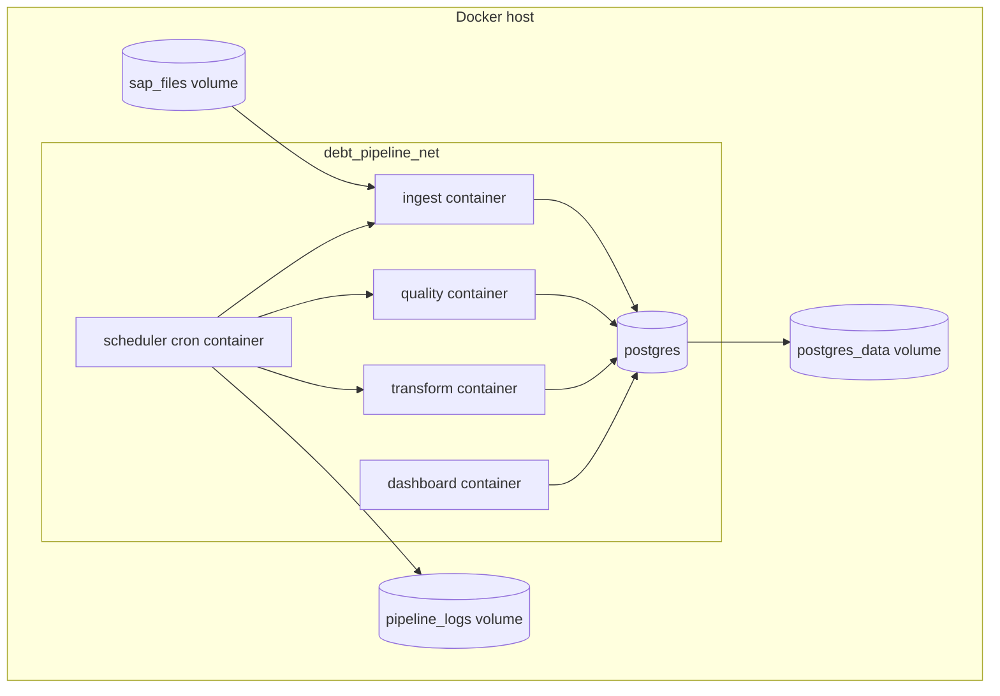

# Evituse Diagramm

## Eesmärk

Dokumendi eesmärk on kirjeldada Docker Compose põhist evituse ülesehitust.

## Ulatus

Ulatus hõlmab teenuseid `postgres`, `ingest`, `quality`, `transform`, `scheduler` ja `dashboard`, volume'id `postgres_data`, `sap_files` ja `pipeline_logs` ning võrku `debt_pipeline_net`.

## Põhikirjeldus

Lahendus töötab Docker Compose keskkonnas. PostgreSQL teenus hoiab andmebaasi. Ingest, quality ja transform teenused on eraldi käivitatavad mikro-teenused. Scheduler konteiner käivitab töövoo croniga. Dashboard konteiner teenindab API-t ja veebiliidest või koosneb ühest Node.js teenusest, mis serveerib staatilist frontend'i.

## Teenused

| Teenus | Roll |
|---|---|
| `postgres` | PostgreSQL andmebaas skeemidega `staging`, `quality`, `mart`, `logs`. |
| `ingest` | Loeb uued SAP XLSX failid ja täidab staging kihi. |
| `quality` | Käivitab kvaliteedikontrollid ja salvestab tulemused. |
| `transform` | Arvutab KPI-d ja uuendab mart kihi. |
| `scheduler` | Käivitab töövoo cron ajakava järgi. |
| `dashboard` | Kuvab võlgnevuste dashboardi ja API. |

## Volume'id Ja Võrk

| Objekt | Kirjeldus |
|---|---|
| `postgres_data` | PostgreSQL püsiv andmemaht. |
| `sap_files` | SAP XLSX failide jagatud maht. |
| `pipeline_logs` | Pipeline töölogide maht. |
| `debt_pipeline_net` | Sisemine Docker Compose võrk. |

## Keskkonnamuutujad

| Muutuja | Kirjeldus |
|---|---|
| `POSTGRES_HOST` | PostgreSQL host, Compose võrgus tavaliselt `postgres`. |
| `POSTGRES_PORT` | PostgreSQL port, tavaliselt `5432`. |
| `POSTGRES_DB` | Andmebaasi nimi. |
| `POSTGRES_USER` | Andmebaasi kasutaja. |
| `POSTGRES_PASSWORD` | Andmebaasi parool. |
| `SAP_FILES_DIR` | Kataloog, kust ingest teenus faile loeb. |
| `LOG_DIR` | Kataloog pipeline logide jaoks. |

## Diagramm



## Docker Compose Struktuuri Näide

```yaml
services:
  postgres:
    image: postgres:16
    volumes:
      - postgres_data:/var/lib/postgresql/data

  ingest:
    build: ./services/ingest
    volumes:
      - sap_files:/data/sap

  quality:
    build: ./services/quality

  transform:
    build: ./services/transform

  scheduler:
    build: ./services/scheduler
    volumes:
      - sap_files:/data/sap
      - pipeline_logs:/var/log/pipeline

  dashboard:
    build: ./services/dashboard
    ports:
      - "3000:3000"
```

Täielikku Compose faili ei looda selles dokumendis, sest teenuste täpne kaustastruktuur ja käivituskäsud tuleb kinnitada rakenduse loomisel.

## Tehnilised Märkused

Scheduler peab käivitama töövoo järjekorras: uue faili kontroll, ingest, kvaliteedikontroll, transformatsioon, mart kihi uuendus ja logimine. Näidis cron rida:

```cron
0 2 * * * /app/scripts/run_pipeline.sh
```

## Küsimused

1. Kas failikataloog on Docker volume või väline võrguketas / pilv ? Projektitöö puhul Docker volume.
2. Kas dashboard peab olema avaldatud ainult sisevõrgus? Jah, ainult sisevõrgus.
3. Kas vaja on eraldi dev, test ja prod Compose konfiguratsioone? Arutame.
