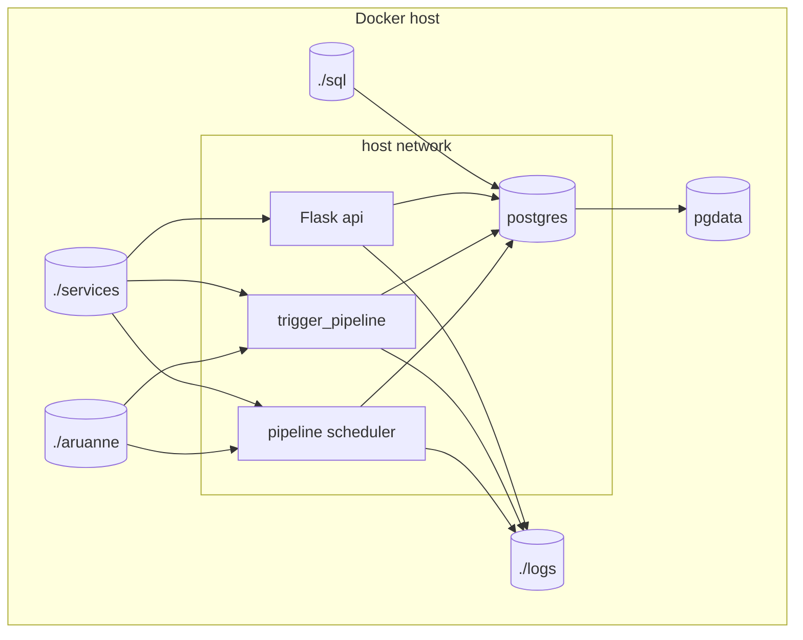

# Evituse Diagramm

## Eesmärk

Dokumendi eesmärk on kirjeldada Docker Compose põhist evituse ülesehitust.

## Ulatus

Ulatus hõlmab teenuseid `postgres`, `pipeline`, `trigger_pipeline` ja `api`, volume'it `pgdata`, bind mount'e `./aruanne`, `./services`, `./sql`, `./logs` ning host-võrgu kasutust.

## Põhikirjeldus

Lahendus töötab Docker Compose keskkonnas. PostgreSQL teenus hoiab andmebaasi ja käivitab skeemi initsialiseerimise `sql/init_schema.sql` failist. `pipeline` konteiner käivitab `scheduler.py`, mis omakorda käivitab ingest ja transform sammud. `trigger_pipeline` on sama töövoo käsitsi käivitatav variant. `api` konteiner käivitab Flask rakenduse, mis serveerib dashboardi HTML vaateid, staatilisi faile ja JSON otspunkte.

## Teenused

| Teenus | Roll |
|---|---|
| `postgres` | PostgreSQL andmebaas skeemidega `staging`, `quality`, `mart`, `logs`. |
| `pipeline` | Käivitab scheduleriga automaatse ingest/quality/transform töövoo. |
| `trigger_pipeline` | Käivitab sama töövoo käsitsi Compose profiili kaudu. |
| `api` | Kuvab võlgnevuste dashboardi ja teenindab JSON API-t. |

## Volume'id Ja Võrk

| Objekt | Kirjeldus |
|---|---|
| `pgdata` | PostgreSQL püsiv andmemaht. |
| `./aruanne` | SAP XLSX failide sisendkaust, konteineris `/data/aruanne`. |
| `./sql` | Andmebaasi initsialiseerimise SQL skriptid. |
| `./services` | Python teenuste, mallide ja staatiliste failide bind mount'id. |
| `./logs` | Pipeline ja API logifailide kaust. |
| `network_mode: host` | Teenused kasutavad hosti võrku ja ühenduvad andmebaasi `localhost` kaudu. |

## Keskkonnamuutujad

| Muutuja | Kirjeldus |
|---|---|
| `POSTGRES_HOST` | PostgreSQL host, Compose võrgus tavaliselt `postgres`. |
| `POSTGRES_PORT` | PostgreSQL port, tavaliselt `5432`. |
| `POSTGRES_DB` | Andmebaasi nimi. |
| `POSTGRES_USER` | Andmebaasi kasutaja. |
| `POSTGRES_PASSWORD` | Andmebaasi parool. |
| `ARUANNE_DIR` | Kataloog, kust ingest teenus faile loeb; vaikimisi `/data/aruanne`. |
| `TARGET_FILENAME` | Otsitava SAP XLSX faili nimi; praegu `LN002 Laenude võlgnevus.xlsx`. |

## Diagramm



## Docker Compose Struktuuri Näide

```yaml
services:
  postgres:
    image: postgres:16
    volumes:
      - pgdata:/var/lib/postgresql/data

  pipeline:
    build: ./services/
    network_mode: host
    volumes:
      - ./aruanne:/data/aruanne:ro
      - ./logs:/app/logs/
    command: python scheduler.py

  api:
    build: ./services/
    network_mode: host
    command: flask --app api run --host '0.0.0.0' --port 5000 --debug
```

Täielik Compose fail asub projekti juures failis `compose.yml`.

## Tehnilised Märkused

Scheduler peab käivitama töövoo järjekorras: faili otsing, ingest, rea kvaliteedikontroll, transformatsioon, mart kihi kontroll, KPI arvutus ja logimine.


