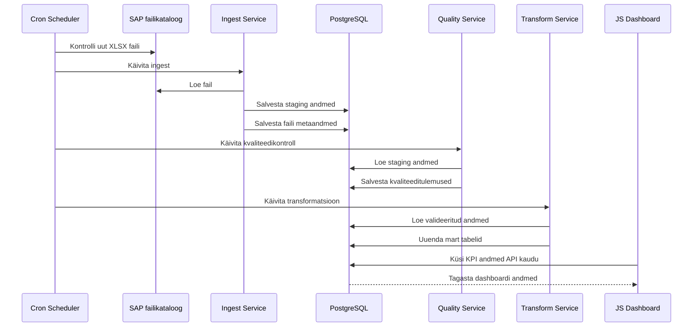

# Järgnevusdiagramm

## Eesmärk

Dokumendi eesmärk on kirjeldada päevase automaatse töövoo järjestus SAP failist dashboardi uuenduseni.

## Ulatus

Ulatus hõlmab cron schedulerit, SAP failikataloogi, ingest teenust, PostgreSQL-i, quality teenust, transform teenust ja dashboardi.

## Põhikirjeldus

Cron käivitab töövoo kokkulepitud ajal. Scheduler kontrollib, kas jagatud kataloogis on uus XLSX fail. Kui uus fail leitakse, käivitab scheduler ingest teenuse. Ingest loeb faili, arvutab kontrollsumma, salvestab faili metaandmed ja toorread staging kihti. Seejärel käivitatakse kvaliteedikontrollid, mille tulemused salvestatakse `quality` skeemi. Transform teenus loeb valideeritud andmed, uuendab mart tabeleid ja arvutab KPI-d. Dashboard loeb API kaudu uuendatud mart andmeid.

## Töövoo Sammud

1. Cron käivitab töövoo.
2. Scheduler kontrollib uut faili.
3. Ingest loeb XLSX faili.
4. Ingest kirjutab staging tabelitesse.
5. Quality kontrollib ridu.
6. Quality kirjutab tulemused.
7. Transform arvutab mart tabelid.
8. Dashboard loeb API kaudu uuendatud andmeid.
9. `logs` skeemi kirjutatakse töö tulemus.

## Diagramm

## Tehnilised Märkused

Iga samm peab kirjutama staatuse `logs.pipeline_runs` tabelisse. Kui ingest ei leia uut faili, peab töövoog lõppema staatuses, mis eristab edukat "uut faili ei olnud" olukorda veast.

## Küsimused

1. Kas ebaõnnestunud sammu korral tehakse automaatne retry? Jah. 
2. Kas dashboard peab kuvama pooleli oleva laadimise staatust? Ei.
3. Kas töövoog võib töödelda mitu uut faili ühes käivituses? Ei, üks fail ühes käivituses.
