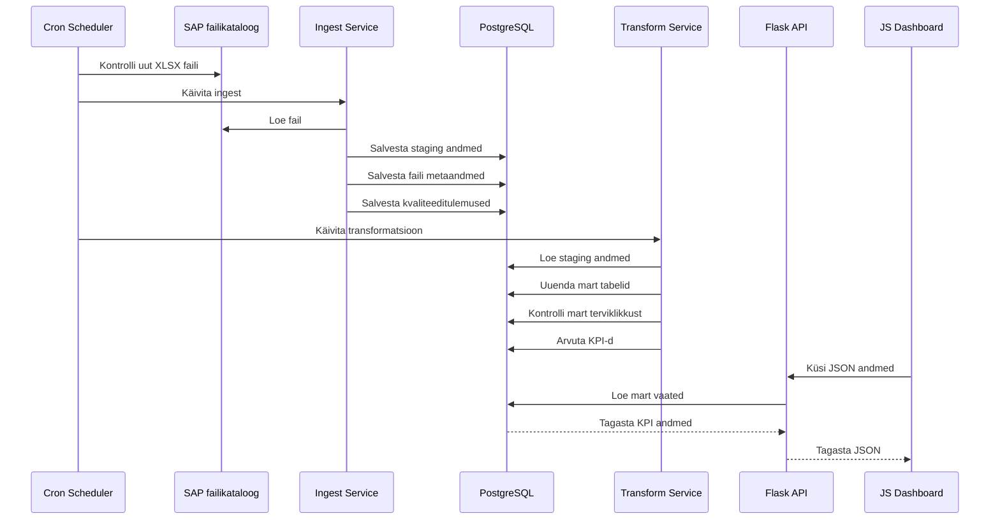

# Järgnevusdiagramm

## Eesmärk

Dokumendi eesmärk on kirjeldada päevase automaatse töövoo järjestus SAP failist dashboardi uuenduseni.

## Ulatus

Ulatus hõlmab schedulerit või käsitsi pipeline triggerit, SAP failikataloogi, ingest/quality loogikat, PostgreSQL-i, transform teenust, Flask API-t ja dashboardi.

## Põhikirjeldus

Scheduler käivitab töövoo kokkulepitud ajal või administraator käivitab selle käsitsi `trigger_pipeline` teenusega. Töövoog kontrollib, kas `ARUANNE_DIR` kataloogis leidub `TARGET_FILENAME` nimega XLSX fail. Kui fail leitakse, loeb ingest selle sisse, arvutab kontrollsumma, salvestab faili metaandmed ja toorread staging kihti ning kirjutab rea kvaliteeditulemused `quality` skeemi. Transform teenus loeb staging andmed, uuendab mart tabeleid, kontrollib mart kihi terviklikkust ja arvutab KPI-d. Dashboard loeb Flask API kaudu uuendatud mart andmeid.

## Töövoo Sammud

1. Cron käivitab töövoo.
2. Scheduler kontrollib uut faili.
3. Ingest loeb XLSX faili.
4. Ingest kirjutab staging tabelitesse.
5. Ingest kontrollib ridu ja kirjutab kvaliteeditulemused.
6. Transform täidab mart dimensioonid ja faktitabeli.
7. Transform kontrollib mart kihi terviklikkust.
8. Transform arvutab KPI-d.
9. Dashboard loeb API kaudu uuendatud andmeid.
10. Teenused kirjutavad käivituse info logifailidesse.

## Diagramm

## Tehnilised Märkused

Iga samm peab kirjutama staatuse logisse. Arhitektuuris on selleks ette nähtud `logs.pipeline_runs` tabel, kuid praegune teostus kirjutab operatiivsed logid `./logs` kausta. Kui ingest ei leia faili, peab töövoog lõppema staatuses, mis eristab edukat "faili ei olnud" olukorda veast.

