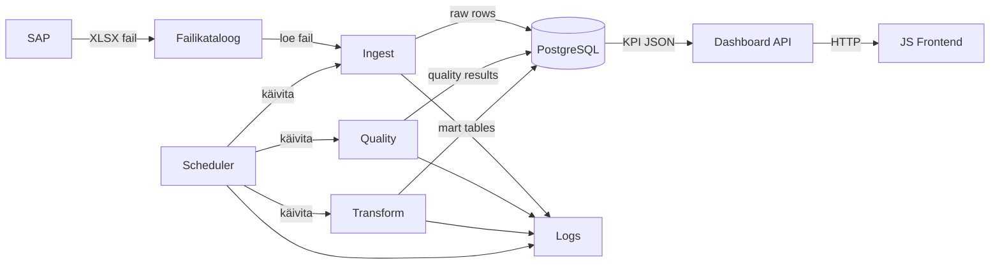

# Kommunikatsioonidiagramm

## Eesmärk

Dokumendi eesmärk on kirjeldada süsteemide ja teenuste vaheline suhtlus.

## Ulatus

Ulatus hõlmab SAP-i, failikataloogi, schedulerit, ingest teenust, quality teenust, transform teenust, PostgreSQL-i, dashboard API-t, JS frontend'i ja logimist.

## Põhikirjeldus

SAP kirjutab XLSX faili jagatud kataloogi. Scheduler käivitab ingest, quality ja transform teenused. Ingest loeb faili ning kirjutab toorandmed PostgreSQL-i. Quality kontrollib andmeid ja salvestab tulemused. Transform ehitab mart kihi. Dashboard API loeb mart kihist KPI andmed JSON kujul ja frontend kuvab graafikud. Kõik teenused kirjutavad staatuse logidesse. Vea korral salvestatakse staatus ja võimalusel käivitatakse retry.

## Diagramm

## Suhtlusvood

| Saatja | Vastuvõtja | Sisu | Protokoll või mehhanism |
|---|---|---|---|
| SAP | Failikataloog | XLSX fail | Failisüsteem |
| Scheduler | Ingest | Käivituskäsk | Shell või container command |
| Scheduler | Quality | Käivituskäsk | Shell või container command |
| Scheduler | Transform | Käivituskäsk | Shell või container command |
| Ingest | PostgreSQL | Toorread ja faili metaandmed | PostgreSQL ühendus |
| Quality | PostgreSQL | Kvaliteeditulemused | PostgreSQL ühendus |
| Transform | PostgreSQL | Mart tabelid ja KPI-d | PostgreSQL ühendus |
| Dashboard API | PostgreSQL | KPI päringud | PostgreSQL ühendus |
| Frontend | Dashboard API | JSON päringud | HTTP |
| Teenused | Logs | Staatused ja vead | PostgreSQL või logifail |

## Tehnilised Märkused

Teenustevaheline suhtlus peab olema idempotentne seal, kus see puudutab failide sissevõttu ja transformatsioone. Kontrollsumma, unikaalsed võtmed ja pipeline logid aitavad vältida dubleerimist.

## Küsimused

1. Kas vajalik on teavitamine e-posti, Slacki või muu kanali kaudu? E-posti teel teavitamine.
2. Kas vea korral peab pipeline peatuma või töötlema järgmise faili edasi? Vea korral peatub, saadab veateate e-postiga; töödeldakse üks fail ühe käivitusega.
3. Kas API peab olema kaitstud autentimisega? Ei (reaalsituatsioonis - sisevõrk).
