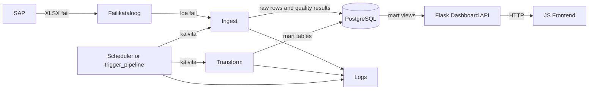

# Kommunikatsioonidiagramm

## Eesmärk

Dokumendi eesmärk on kirjeldada süsteemide ja teenuste vaheline suhtlus.

## Ulatus

Ulatus hõlmab SAP-i, failikataloogi, schedulerit või käsitsi pipeline triggerit, ingest/quality/transform loogikat, PostgreSQL-i, Flask dashboard API-t, JS frontend'i ja logimist.

## Põhikirjeldus

SAP XLSX fail paikneb jagatud kataloogis. Scheduler või `trigger_pipeline` käivitab Python töövoo. Ingest loeb faili, kirjutab toorandmed PostgreSQL-i ning salvestab rea kvaliteeditulemused. Transform ehitab mart kihi, teeb mart kontrollid ja arvutab KPI-d. Flask API loeb mart kihist KPI andmed JSON kujul ja frontend kuvab graafikud ning raporti. Teenused kirjutavad staatuse logidesse. Vea korral salvestatakse staatus ning töövoog katkestab riskantsed hilisemad sammud.

## Diagramm

## Suhtlusvood

| Saatja | Vastuvõtja | Sisu | Protokoll või mehhanism |
|---|---|---|---|
| SAP | Failikataloog | XLSX fail | Failisüsteem |
| Scheduler või trigger_pipeline | Ingest | Käivituskäsk | Python mooduli käivitus konteineris |
| Scheduler või trigger_pipeline | Transform | Käivituskäsk | Python mooduli käivitus konteineris |
| Ingest | PostgreSQL | Toorread, faili metaandmed ja kvaliteeditulemused | PostgreSQL ühendus |
| Transform | PostgreSQL | Mart tabelid, mart kontrollid ja KPI-d | PostgreSQL ühendus |
| Dashboard API | PostgreSQL | KPI päringud | PostgreSQL ühendus |
| Frontend | Dashboard API | JSON päringud `/overdues_summary`, `/overdues_counts`, `/overdues_data` | HTTP |
| Teenused | Logs | Staatused ja vead | Logifail ning arhitektuuriliselt `logs.pipeline_runs` |

## Tehnilised Märkused

Teenustevaheline suhtlus peab olema idempotentne seal, kus see puudutab failide sissevõttu ja transformatsioone. Kontrollsumma, unikaalsed võtmed ja pipeline logid aitavad vältida dubleerimist.

